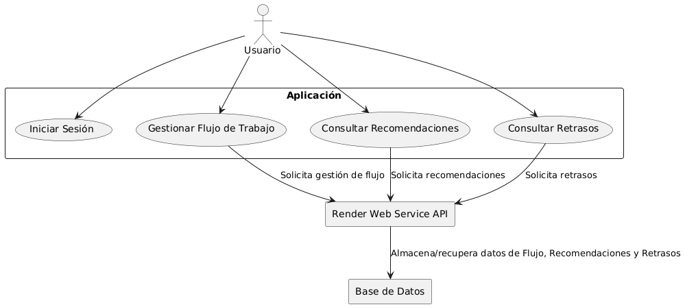
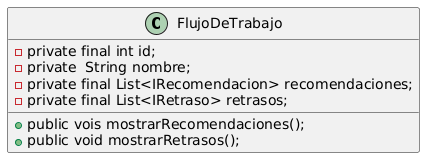
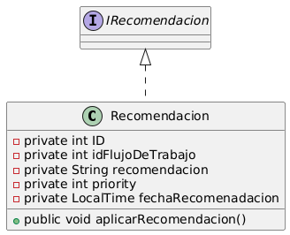
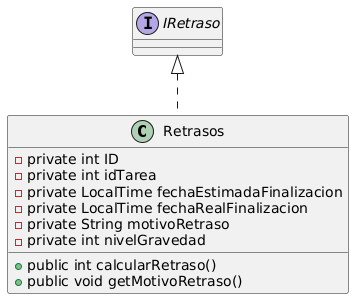

# Actividad-2
Link a Repostorio --> https://github.com/YoelUb/Actividad-2

En este proyecto se planteo realizar un desarrollo software para definir una arquitectura para una plataforma inteligente de gestión de proyectos potenciada por inteligencia artificial, la cual permitirá a los equipos optimizar sus flujos de trabajo, predecir retrasos y recibir recomendaciones para mejorar la productividad


## Diagrama de UML













Caracteristicas Principales: 

- Gestión eficiente de flujos de trabajo.

- Predicción de retrasos en tareas y proyectos.

- Recomendaciones basadas en inteligencia artificial para optimizar la productividad.

- Modularidad y escalabilidad en la arquitectura del sistema.


Requisitos Previos: 

- Java 17 o superior.
  
- Entero de desarrollo IntelliJ IDEA o Eclipse.
  
- Tener GIT instalado para poder clonar mi repositorio


## Ejecutar el Proyecto:

- Clonar el repositorio (Terminal):

  ```bash
  git clone https://github.com/YoelUb/Actividad2
  
# Contacto
# Si tienes preguntas o sugerencias, contacta con yurqubar@myuax.com.


